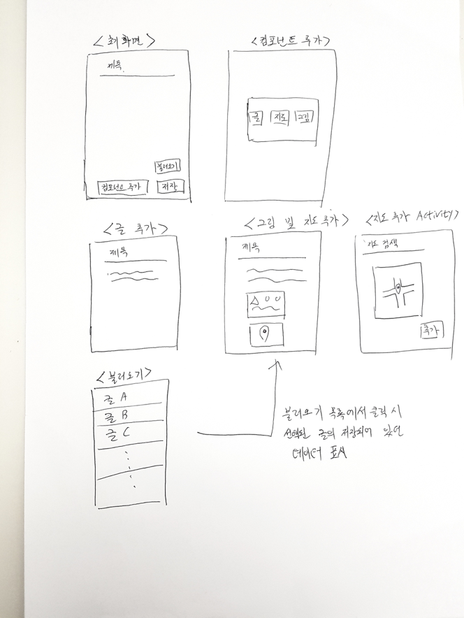

# LessSmartEditor ( 2017. 05. 11~ )

간단한 Android Editor App 개발. 개발 요구사항은 다음과 같다.

1.	에디터에서 작성할 수 있는 컴포넌트의 종류는 글, 그림, 지도가 있다.
2.	에디터에 위 컴포넌트 중 하나를 추가할 때에는 <추가>버튼을 누른 후, 나오는 목록 중에 하나를 선택하는 방식으로 한다.
3.	컴포넌트를 추가하고 제거하는 것은 RecyclerView를 활용하도록 한다.
4.	최초의 작성된 컴포넌트들은 삭제는 가능하나 서로의 위치를 옮기는 등의 기능은 없도록 한다.(단, 글의 경우엔 수정 가능)
5.	지도 컴포넌트는 Retrofit을 사용하여 Naver 지도 Open API와 SDK를 활용하도록 한다.
6.	지도와 그림 컴포넌트는 고정된 크기로만 삽입된다.
7.	그림 삽입 시 Glide를 활용한다.
8.	저장 버튼을 누를 시 각 컴포넌트의 위치와 정보가 내장된 데이터베이스에 저장되도록 한다. 이 때 SQLite를 활용하여 구현한다.
9.	불러오기 기능을 통해서 데이터베이스에 저장되어 있는 글들을 불러 올 수 있다.
10.	아래 그림의 디자인은 예시이며, 따라할 필요 없이 디자인은 각자 구현한다. 단, 동일한 기능의 동작이 가능해야 한다.

+ TITLE에 입력 글자 수의 제한을 둔다.

-------------

### INFO

5/11-----------------

JSON & SQLITE 
http://stackoverflow.com/questions/16603621/how-to-store-json-object-in-sqlite-database

Partial Bold 
http://stackoverflow.com/questions/14371092/how-to-make-a-specific-text-on-textview-bold
http://stackoverflow.com/questions/1529068/is-it-possible-to-have-multiple-styles-inside-a-textview

Text Watcher 
http://stackoverflow.com/questions/7818438/how-to-insert-image-to-a-edittext

Check truncated 
http://stackoverflow.com/questions/2923345/is-there-a-way-to-check-if-a-textviews-text-is-truncated

how to create different view type in recyclerView 
http://stackoverflow.com/questions/26245139/how-to-create-recyclerview-with-multiple-view-type?rq=1

http://stackoverflow.com/questions/25914003/recyclerview-and-handling-different-type-of-row-inflation/29362643#29362643

http://stackoverflow.com/questions/39971350/recycle-view-inflating-different-row-getting-exception-while-binding-the-data/39972276#39972276

5/12-------------------------------------

이미지 선택, 크롭, 저장 
http://ankyu.entersoft.kr/Lecture/android/gallery_01.asp

리사이클러 뷰 
http://itmining.tistory.com/12

HTTP 
https://www.joinc.co.kr/w/Site/Network_Programing/AdvancedComm/HTTP

REST 
https://www.joinc.co.kr/w/man/12/rest/about

REST API 제대로 알고 사용하기 
http://meetup.toast.com/posts/92

쿠키 
https://www.joinc.co.kr/w/man/12/cookie

쿠키의 취약성 및 요구되는 보안성 
http://egloos.zum.com/heyjoon/v/846358

비지니스 로직 
http://m.blog.naver.com/anjdieheocp/20117559228'

에디터 
https://www.froala.com/wysiwyg-editor

세션이란 
http://mohwaproject.tistory.com/entry/HTTP-Session-%EC%9D%B4%EB%9E%80

HTTP 1.1 캐시관련 헤더 
http://icecreamie.tistory.com/52

안드로이드 HTTP 클라이언트 라이브러리 
http://d2.naver.com/helloworld/377316

안드로이드 이미지로딩 라이브러리 
http://d2.naver.com/helloworld/429368

5/19 -----------------

mvp 패턴 
https://www.slideshare.net/madvirus/mvp-63161829

architecture pattern, design pattern의 차이에 대하여 
http://stackoverflow.com/questions/4243187/whats-the-difference-between-design-patterns-and-architectural-patterns

리스트 뷰에 MVP를? 무슨 소리지? 
http://stackoverflow.com/questions/24858050/how-to-control-listview-with-mvp-pattern-for-android

어뎁터는 뭘까? 데이터? 뷰? 
https://medium.com/@jsuch2362/adapter-%EB%88%84%EA%B5%AC%EB%83%90-%EB%84%8C-data-view-2db7eff11c20

처음부터 따라가는 MVP 
http://thdev.tech/androiddev/2016/06/14/Android-TODO-MVP-Example.html

—————

### ISSUE LOG

5/11(목)

android.view.WindowLeaked in Custom Dialog 
http://sjava.net/2011/11/androidviewwindowleaked-%EB%AC%B8%EC%A0%9C%EC%97%90-%EB%8C%80%ED%95%9C-%ED%95%B4%EA%B2%B0%EC%B1%85/

RecyclerView 순서 강제 
http://stackoverflow.com/questions/32065267/recyclerview-changing-items-during-scroll

5/12(금)

database 설계 - 컴포넌트들을 어떻게 저장하고 정보를 가져올 것인가?

**Editor Adapter에 본래의 기능 이외에 기능들이 포함 분리가 필요**

5/18(목)
Component 설계 문제 인지

5/19(금)
컴포넌트, 뷰 사이 data 전달 문제 인지
->18일 Component 설계 문제와 함께 위 문제의 해결 방안으로 MVP 패턴 선택

5/21(일)
MVP 패턴으로 설계 변환 진행 중

—————————

### 추가로 더 알아볼 것들

RecyclerView & ViewHolder 동작과정

세션과 쿠키에 대해서 얘기가 너무 중구난방..?

GET POST의 구분
