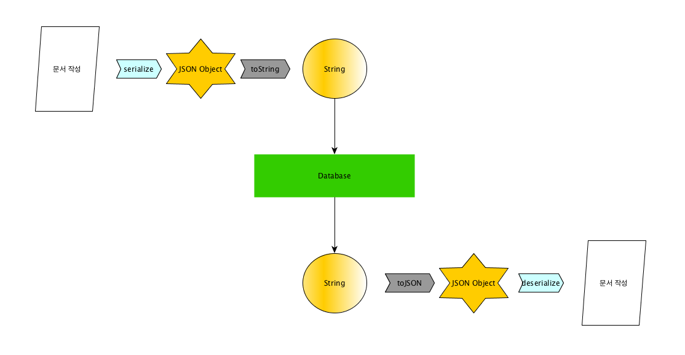

# LessSmartEditor
-------

### 목차

1. 요구 사항  
1. 구현 설계 
	a. 데이터 구조 및 처리 방식 
	b. RecyclerView Adapter 구조 
    c.  
1. 계획  

------------

### 구현 설계

#### a. 데이터 구조 및 처리

***데이터 구조***
~~~
COMPONENT TYPE VALUE :
	TEXT_COMPONENT = 0;
    IMG_COMPONENT = 1;
    MAP_COMPONENT = 2;

Document {

	Id : 문서 식별자
	Title : Document 제목
    TimeStemp : Document 작성 시간

	TextComponent {
		String text : 글 내용에 대한 Data
		int componentType : 컴포넌트 타입 속성값
		int index : 해당 컴포넌트가 갖는 document 내에서의 위치 정보
	}

	ImgCompenent {
		String src(URI, URL) : 이미지에 대한 source data
		int componentType : 컴포넌트 타입 속성값
		int index : 해당 컴포넌트가 갖는 document 내에서의 위치 정보
	}

	MapComponent {
		String placeInform : 위치에 대한 정보 - 건물명, 주소 등 (미정)
		double CoordsX, CoordsY : 해당 위치에 대한 좌표 정보 (위도, 경도)
		int componentType : 컴포넌트 타입 속성값
		int index : 해당 컴포넌트가 갖는 document 내에서의 위치 정보
	}
}
~~~

***데이터 처리***

문서 내부 컴포넌트들은 직렬화 과정을 통해 JSON으로 파싱되며, 이 때 컴포넌트들은는 위에서 아래로 순서대로 처리된다.

=> 컴포넌트의 문서 내 위치가 자동으로 결정된다.

-------

컴포넌트는 에디터 액티비티 내 RecyclerView에 추가된다.

Adapter는 세 종류의 ViewHolder를 가지며, 내부에 Object[]의 요소에 의해 종류가 결정된다.

~~~
Adapter {

	Text ViewHolder : 텍스트 컴포넌트의 ViewHolder

	Img ViewHolder : 이미지 컴포넌트의 ViewHolder

    Map ViewHolder : 지도 컴포넌트의 ViewHolder

}

~~~

### 컴포넌트 ----

#### 텍스트 컴포넌트
-EditText를 추가하고, TextWatch나 InputFileter로 내부 변화 값을 매번 갱신하거나, 데이터 저장시 일괄적으로 처리한다.

#### 이미지 컴포넌트
-URL을 사용자로부터 직접 입력 받거나, 디바이스 갤러리에 접근하여 URI를 받아 Glide로 이미지를 띄운다.

#### 지도 컴포넌트
...

Naver Android Map SDK 
Naver Android static Map API

tutorial : https://developers.naver.com/docs/map/tutorial/

주소 입력 -> API 요청 -> 좌표 반환 -> 좌표를 통한 static map(IMG) request API -> Img

--------

5/11

데이터 저장 방식 및 구조 설계 
앱 동작 설계 및 레이아웃 결정

5/12

텍스트 컴포넌트 추가 동작 구현 
Glide를 통한 이미지 추가

5/13

네이버 지도 API와 SDK를 이용한 지도 정보 추가 - 1

5/14

네이버 지도 API와 SDK를 이용한 지도 정보 추가 - 2
지도 컴포넌트 추가 동작 구현 - 2

5/15

Adapter에 컴포넌트 타입별 ViewHolder 추가 
데이터 처리 - 1 (컴포넌트 -> JSON로 파싱 -> 데이터베이스)

5/16

데이터 처리 - 2 (데이터베이스 -> JSON -> 컴포넌트)

5/17

5/18

요구 조건 완료 및 점검

5/19

완료

-------

### 추가

1. 텍스트 부분 강조

1. 이미지 & 지도 드래그 드롭으로 위치 변경
